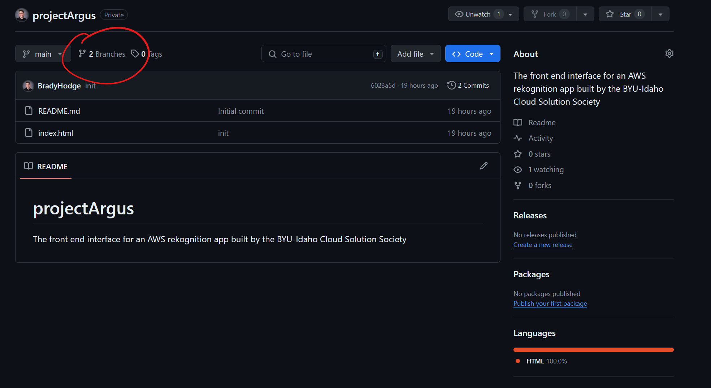
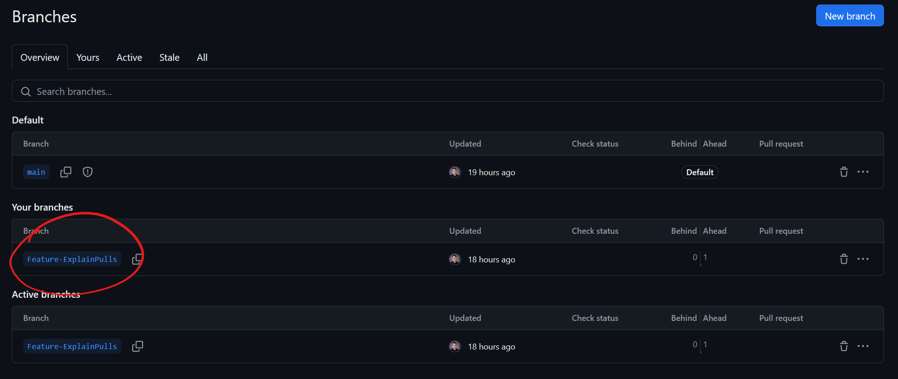
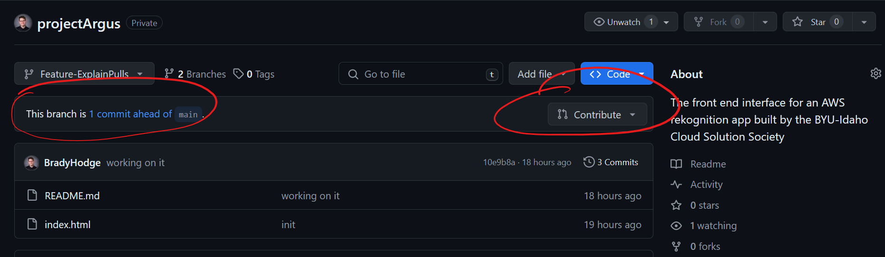
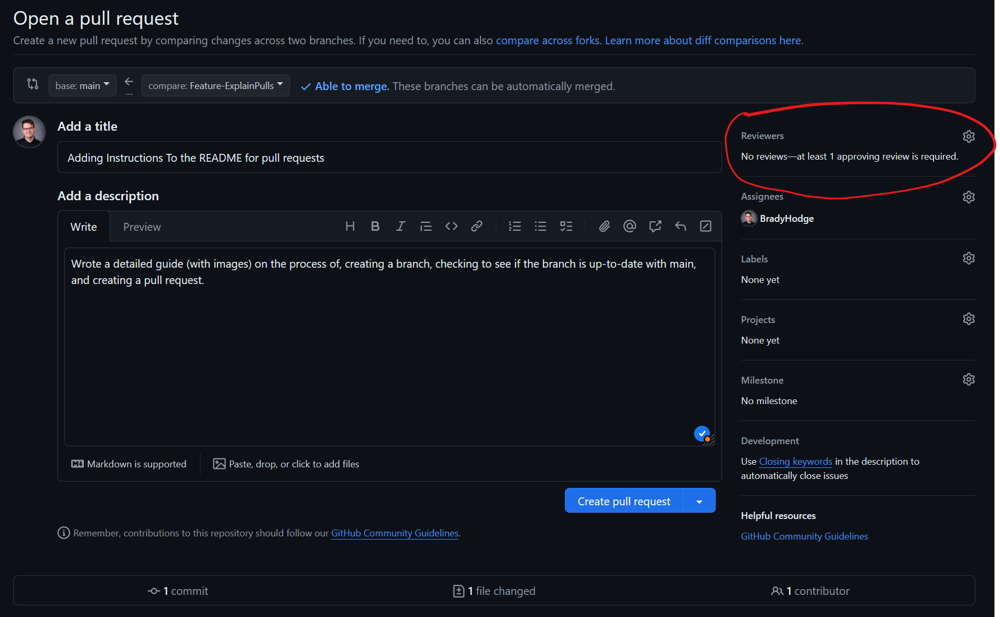

# projectArgus
This is the front end interface for an AWS rekognition app built by the BYU-Idaho Cloud Solution Society. 

# How to Contribute

## 1. Create a new branch following this naming scheme:
- Feature - Add new functionality to the program
- Fix - Remove a bug or other issue, but keep the functionality the same
- Other -  Does not fit into another category

Example: `Feature-AddLoginPage` or `Fix-LoginPageBug`

## 2. Make the change
Write the code to add the feature or fix the bug in your new branch and test it to the best of your ability.

## 3. Make sure your branch is up to date with `Main` 
Go to [GitHub.com](https://github.com/BradyHodge/projectArgus), click on the "Branches" tab.

Select the branch that you would like pull into main.

Make sure that it says "This branch is X commits ahead and 0 commits behind main", then press the Contribute button and open a pull request.

## 4. Create a pull request
Add a title and description, then select a collaborator to review your changes.

Then your changes will be pulled into main as soon as the changes are reviewed.